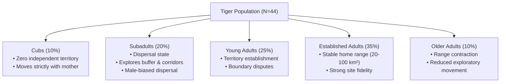
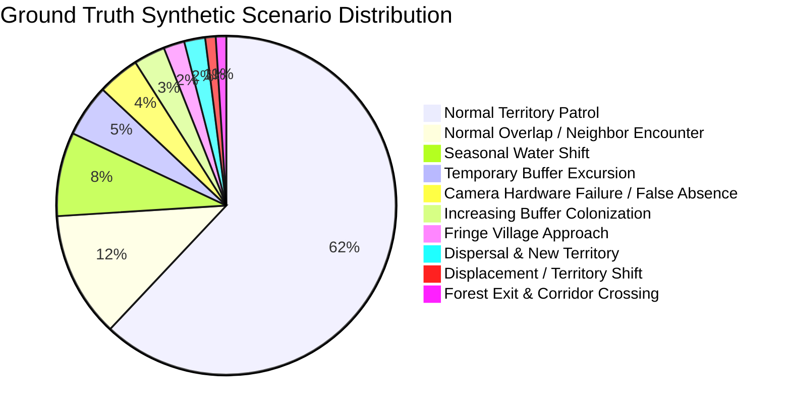
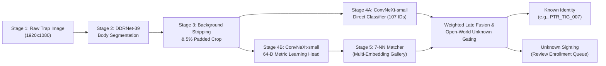
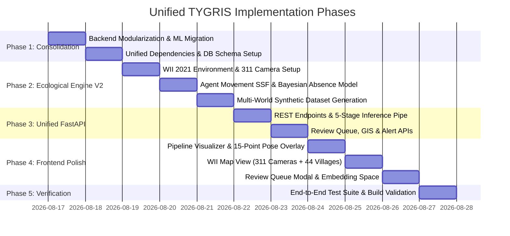

# TYGRIS: Unified Ecological Simulation, Visual Re-ID & Spatio-Temporal Wildlife Monitoring Platform
## Complete Architecture, Scientific Specification & Implementation Workflow

---

## 📑 Table of Contents
1. [Executive Summary & System Architecture](#1-executive-summary--system-architecture)
2. [Formal Pench Ecological Simulation Engine (Synthetic Generator V2)](#2-formal-pench-ecological-simulation-engine-synthetic-generator-v2)
   - 2.1 Environmental GIS & Multi-Scale Grid Representation
   - 2.2 Camera Trap Network Architecture (WII 311-Station Anchor)
   - 2.3 Agent-Based Tiger Population & Individual Heterogeneity
   - 2.4 Fine-Scale Movement Dynamics & Probabilistic Step Selection
   - 2.5 Observation Process & Camera Detection Model
   - 2.6 Territory Dynamics & Anomaly Taxonomy
   - 2.7 Disentangling Behavioral Anomalies from Survey Artefacts
   - 2.8 Multi-World Simulation & Zero-Leakage Dataset Partitioning
3. [Paper-Faithful Visual Re-ID Pipeline (Ma et al., 2025)](#3-paper-faithful-visual-re-id-pipeline-ma-et-al-2025)
   - 3.1 5-Stage Visual Transformation Pipeline
   - 3.2 Dual-Branch Deep Feature Extraction
   - 3.3 Weighted Late Fusion & 7-NN Metric Matching
   - 3.4 15-Point Anatomical Pose Keypoint Integration
   - 3.5 Open-World Gating & Human-in-the-Loop Enrollment
4. [Spatio-Temporal Ecological Intelligence & Alert Engine](#4-spatio-temporal-ecological-intelligence--alert-engine)
   - 4.1 Task 1: Movement & Trajectory Forecasting
   - 4.2 Task 2: Individual Baseline Anomaly Detection
   - 4.3 Task 3: Survey Quality & Camera Effort Reasoning
   - 4.4 Task 4: Persistent Territory Shift Detection (100% MCP & Kernel Density)
   - 4.5 Human-Wildlife Conflict Alert Classification (🟢 Safe, 🟡 Caution, 🔴 Critical)
5. [Unified System Architecture & Data Schemas](#5-unified-system-architecture--data-schemas)
   - 5.1 4-Layer Database Architecture
   - 5.2 Unified FastAPI REST API Specification
   - 5.3 Consolidated Repository Directory Structure
6. [Next.js 16 Glassmorphic Monitoring Dashboard](#6-nextjs-16-glassmorphic-monitoring-dashboard)
7. [Step-by-Step Migration & Implementation Roadmap](#7-step-by-step-migration--implementation-roadmap)
8. [Verification, Validation & Benchmark Plan](#8-verification-validation--benchmark-plan)

---

# 1. Executive Summary & System Architecture

The **TYGRIS Platform** integrates two foundational pillars into a unified, research-grade wildlife monitoring and ecological intelligence system:
1. **Paper-Faithful Computer Vision Re-ID Pipeline**: Implements the dual-branch deep learning architecture and DDRNet-39 background segmentation from *Ma et al., Ecological Indicators (2025)* to identify individual tigers from camera-trap photos across fluctuating illumination, dense foliage, and open-world population dynamics.
2. **WII-Calibrated Ecological Simulation & GIS Engine**: Implements an agent-based spatio-temporal movement simulator calibrated against the **Wildlife Institute of India (WII) 2021 Pench Tiger Reserve Monitoring Report** (311 camera stations, 8,415 trap nights, $\ge 44$ individual tigers, 2 km² sampling grids, core vs. buffer prey densities, and female philopatry / male-biased dispersal).

```mermaid
flowchart TB
    subgraph Layer_1_Geography ["Layer 1: Pench GIS Environment"]
        G1["Pench Core (439 km²) & Buffer (301 km²)"]
        G2["2 km² WII Sampling Grids + 100m Raster Cells"]
        G3["Prey Densities (Core: 24.28/km² Chital vs Buffer: 8.63/km²)"]
        G4["Water Bodies, Rivers, Corridors & 44 Perimeter Villages"]
    end

    subgraph Layer_2_HiddenTruth ["Layer 2: Agent Movement & Hidden Ground Truth"]
        T1["Individual Tiger Agents (Sex, Age, Life Stage, Philopatry)"]
        T2["Probabilistic Step Selection (Habitat + Prey + Water - Disturbance)"]
        T3["Territory & Home Range Baselines (20 - 100+ km²)"]
        T4["Hidden Anomaly Injection (Dispersal, Excursions, Shifts, Village Approaches)"]
    end

    subgraph Layer_3_Observation ["Layer 3: Camera Trap Observation Process"]
        C1["311 WII Reference Camera Stations (Trail/Corridor Biased)"]
        C2["Detection Model: P(detect | distance, angle, activity, weather)"]
        C3["Survey Artefacts: Offline Cameras, Battery Failure, Night IR Loss"]
        C4["Raw Sighting Capture Events (Detected vs. Missed)"]
    end

    subgraph ML_Vision_Pipeline ["ML Vision Pipeline (Ma et al. 2025)"]
        V1["Stage 1: Raw Ingestion & QC Audit"]
        V2["Stage 2: DDRNet-39 Body Segmentation (MIoU=0.83)"]
        V3["Stage 3: Background Stripping & 5% Padded Crop"]
        V4["Stage 4A: ConvNeXt Representation (Closed-Set Ranking)"]
        V4B["Stage 4B: ConvNeXt 64-D Metric Learning (Multi-Sim Loss)"]
        V5["Stage 5: 7-NN Euclidean Matcher & Weighted Late Fusion"]
        V6["Open-World Gating (Known Tiger vs Unknown Enrollment)"]
        V7["15-Point Anatomical Pose Keypoint Extraction"]
    end

    subgraph SpatioTemporal_Engine ["Spatio-Temporal Ecological & Alert Engine"]
        E1["Task 1: Next Movement Forecasting"]
        E2["Task 2: Individual Historical Baseline Anomaly Detection"]
        E3["Task 3: Observation Quality / Camera Effort Reasoning"]
        E4["Task 4: Persistent Territory Shift Detection (100% MCP)"]
        E5["Human-Wildlife Conflict Alert Engine (🟢 SAFE, 🟡 CAUTION, 🔴 CRITICAL)"]
    end

    subgraph Web_Dashboard ["Unified Web Dashboard (Next.js 16 + FastAPI)"]
        U1["Live 5-Stage Vision Transformation Visualizer"]
        U2["WII Pench GIS Map (311 Cameras, 11 Ranges, MCP Polygons, Conflict Heatmap)"]
        U3["Tiger Catalogue & 15-Point Pose Skeleton Inspector"]
        U4["Human-in-the-Loop Review & Enrollment Modal"]
        U5["2D Metric Embedding Space Cluster Visualizer"]
    end

    Layer_1_Geography --> Layer_2_HiddenTruth
    Layer_2_HiddenTruth --> Layer_3_Observation
    Layer_3_Observation --> ML_Vision_Pipeline
    ML_Vision_Pipeline --> SpatioTemporal_Engine
    SpatioTemporal_Engine --> Web_Dashboard
```



---

# 2. Formal Pench Ecological Simulation Engine (Synthetic Generator V2)

The synthetic engine operates as an agent-based ecological simulation where tiger movement decisions and camera trap detections are modeled from first principles.

## 2.1 Environmental GIS & Multi-Scale Grid Representation

### Pench Geography & Vector Boundaries
The simulation environment is built upon the actual geometry of **Pench Tiger Reserve (Maharashtra / Madhya Pradesh)**:
- **Total Area**: $\sim 740\text{ km}^2$
- **Core Zone Boundary**: $439.24\text{ km}^2$ (strictly protected, high canopy cover, minimal human activity).
- **Buffer Zone Boundary**: $301.97\text{ km}^2$ (multiple-use zone, regulated grazing, bordering agricultural fields).
- **Sub-Regions (11 Ranges)**: East Pench, West Pench, Center Pench, Devalapar, Chorbahuli, Saleghat, Paoni, Nagalwadi, Sillari, Mansar, and the NH-44 Wildlife Mitigation Corridor.
- **Village Perimeters**: 44 mapped boundary villages along the fringe.
- **Hydrological Network**: Pench River, Totladoh Reservoir, perennial streams, natural waterholes, and artificial wildlife saucers.
- **Road Network & Corridors**: National Highway 44 (with underpasses), state roads, unpaved forest patrol trails, and seasonal firelines.

```
       [Madhya Pradesh Core: Totladoh Reservoir / River Pench]
                             |
                   +---------+---------+
                   |   CORE FOREST     |  (Prey Density: HIGH)
                   |  (439.24 km²)     |  (Human Disturbance: ZERO)
                   +---------+---------+
                             |
                   +---------+---------+
                   |   BUFFER ZONE     |  (Prey Density: MODERATE)
                   |  (301.97 km²)     |  (Grazing / Human Disturbance: LOW-MED)
                   +---------+---------+
                             |
             [44 Fringe Villages & NH-44 Corridor] (HIGH CONFLICT RISK)
```

### Multi-Scale Spatial Representation
1. **Primary Ecological Sampling Grid (2 km²)**:
   - Matches the official WII sampling framework. Every camera station and sighting event is indexed to a unique `grid_id` (e.g. `PTR_GRID_142`).
2. **Fine-Scale Movement Raster (100m $\times$ 100m cells)**:
   - Used internally for step-by-step movement pathing, terrain cost, and obstacle collision.
   - Each cell $(x, y)$ stores:
     - `habitat_type` $\in \{\text{Dense Teak Forest}, \text{Mixed Deciduous}, \text{Bamboo Clumps}, \text{Riparian}, \text{Grassland Meadow}, \text{Agricultural Scrub}\}$
     - `prey_density` $[\text{individuals/km}^2]$
     - `water_distance_km` $[\text{km}]$
     - `human_disturbance_index` $\in [0.0, 1.0]$
     - `slope_steepness` $[\text{degrees}]$

### Prey Density Layer Calibration (WII 2021 Report)
Prey distributions are sampled from truncated normal distributions $(\mu, \sigma)$ calibrated to the WII 2021 empirical line-transect estimates:

| Prey Species | Core Zone Density ($\text{ind/km}^2$) | Buffer Zone Density ($\text{ind/km}^2$) | Ecological Role |
| :--- | :---: | :---: | :--- |
| **Chital (*Axis axis*)** | $\mathcal{N}(24.28, 3.12)$ | $\mathcal{N}(8.63, 1.84)$ | Primary diurnal prey, meadow/edge preference |
| **Sambar (*Rusa unicolor*)** | $\mathcal{N}(6.08, 0.95)$ | $\mathcal{N}(1.36, 0.42)$ | Primary nocturnal/dense forest prey |
| **Wild Pig (*Sus scrofa*)** | $\mathcal{N}(4.31, 0.81)$ | $\mathcal{N}(2.10, 0.55)$ | Ubiquitous, riparian & scrub forager |
| **Gaur (*Bos gaurus*)** | $\mathcal{N}(1.56, 0.35)$ | $\mathcal{N}(0.40, 0.15)$ | High-biomass herd prey, ridge & valley preference |
| **Northern Plains Gray Langur** | $\mathcal{N}(17.02, 2.50)$ | $\mathcal{N}(9.10, 1.90)$ | Canopy prey & alarm-call signal source |
| **Nilgai (*Boselaphus tragocamelus*)** | $\mathcal{N}(1.91, 0.45)$ | $\mathcal{N}(3.20, 0.70)$ | Open scrub & buffer zone specialist |
| **Barking Deer / Chausingha** | $\mathcal{N}(0.59, 0.18)$ | $\mathcal{N}(0.15, 0.08)$ | Dense understory specialist |

---

## 2.2 Camera Trap Network Architecture (WII 311-Station Anchor)

### A. Reference Station Deployment (311 Cameras)
Calibrated to the 2021 WII survey effort (**311 dual-camera stations across 8,415 total trap-nights**):
- **Core Deployment**: $\sim 210$ stations ($\sim 0.48\text{ stations/km}^2$).
- **Buffer Deployment**: $\sim 101$ stations ($\sim 0.33\text{ stations/km}^2$).

### B. Synthetic Evaluation Densities
The simulator supports parametric camera network sizes for stress-testing detection algorithms under varying sampling effort:
$$\text{Camera Counts} \in \{250, 311, 350, 400, 500\}$$

### C. Realistic Non-Uniform Camera Siting
In accordance with WII field protocol, cameras are **never** placed on a uniform Cartesian grid. Siting probability $P(\text{site})$ is biased along wildlife travel routes:
$$P(\text{site} \mid x, y) \propto w_{\text{trail}} \cdot \mathbb{I}_{\text{trail}} + w_{\text{river}} \cdot e^{-d_{\text{water}} / 0.5} + w_{\text{ridge}} \cdot \mathbb{I}_{\text{ridge}} + w_{\text{corridor}} \cdot \mathbb{I}_{\text{corridor}} - w_{\text{road}} \cdot \mathbb{I}_{\text{paved\_road}}$$

### D. Camera Metadata Schema
Each camera station record contains:
```yaml
camera_id: "PTR_CAM_184"
latitude: 21.68412
longitude: 79.31205
grid_id: "PTR_GRID_092"
zone: "CORE"                      # CORE | BUFFER | CORRIDOR | FRINGE
sub_region: "East Pench"
habitat: "Mixed Deciduous Riparian"
elevation_m: 342.5
nearest_water_km: 0.18
nearest_village_km: 4.82
nearest_road_km: 0.65
trail_type: "Dry Stream Bed (Nallah)" # Animal Trail | Forest Track | Nallah | Ridge Line
active_from: "2025-11-01T00:00:00"
active_until: "2026-03-31T23:59:59"
operational_status: "OPERATIONAL"   # OPERATIONAL | OFFLINE | BATTERY_LOW | IR_FAILED
```

---

## 2.3 Agent-Based Tiger Population & Individual Heterogeneity

### Base Population Scale
- **Base Scenario**: $N = 44$ adult/subadult individual tigers (matching the minimum recorded in 2021 monitoring).
- **Simulation Ensemble**: Scenarios with $N \in [35, 40, 44, 50, 55, 60]$ tigers.

### Demographic & Life-Stage Traits
Tigers are initialized with biological priors derived from Pench ecological and genetic studies:



### Sex-Biased Philopatry vs. Dispersal (PMC Study Calibration)
- **Adult Females**: High philopatry. Home ranges established near natal territory ($\text{centroid shift} \le 4\text{ to }7\text{ km}$). Stable territory size $\sim 20\text{ to }50\text{ km}^2$.
- **Subadult Males**: High dispersal propensity ($P(\text{disperse}) \ge 0.75$). Long-distance exploration through corridors and buffer zones ($20\text{ to }80+\text{ km}$ total trajectory), establishing larger adult territories ($60\text{ to }120+\text{ km}^2$).
- **Subadult Females**: Moderate dispersal / budding off peripheral maternal range ($P(\text{disperse}) \sim 0.25$).

### Individual Tiger Agent Parameter Profile
```python
@dataclass
class TigerAgent:
    tiger_id: str                   # e.g., "PTR_TIG_014"
    sex: str                        # "MALE" | "FEMALE"
    age_years: float                # 0.5 to 14.0
    life_stage: str                 # "CUB" | "SUBADULT" | "YOUNG_ADULT" | "ADULT" | "OLDER_ADULT"
    body_condition: float           # 0.5 (injured/poor) to 1.0 (prime)
    territorial_status: str         # "RESIDENT" | "TRANSIENT" | "DISPERSING" | "DISPLACED"
    home_range_target_km2: float    # Sampled: Female: 20-55 km², Male: 50-120 km²
    core_centroid: tuple[float, float] # (lat, lon)
    flank_stripe_seed: int          # For deterministic synthetic Re-ID image mapping
    water_dependency: float         # 0.6 (winter) to 1.0 (peak summer)
    human_avoidance: float          # 0.7 (bold subadult) to 0.99 (shy resident female)
    village_tolerance: float        # 0.05 to 0.35
    activity_profile: str           # "CREPUSCULAR_NOCTURNAL" | "NOCTURNAL" | "CATHEMERAL"
    current_state: str              # "RESTING" | "FORAGING" | "PATROLLING" | "DISPERSING"
    current_coords: tuple[float, float]
    step_history: list[dict]
```

---

## 2.4 Fine-Scale Movement Dynamics & Probabilistic Step Selection

### Movement Engine Formulations
Tiger trajectories are generated on the 100m raster grid using a Step-Selection Function (SSF). The probability of choosing next raster neighbor cell $j$ from current cell $i$ at time $t$ is:

$$P(\text{step } i \to j \mid \mathbf{x}_i, \mathbf{s}_t) = \frac{\exp\left(\mathcal{U}(j \mid \mathbf{x}_i, \mathbf{s}_t)\right)}{\sum_{k \in \mathcal{N}(i)} \exp\left(\mathcal{U}(k \mid \mathbf{x}_i, \mathbf{s}_t)\right)}$$

where the cell utility score $\mathcal{U}(j)$ is formulated as:

$$\begin{aligned}
\mathcal{U}(j) = &\;\beta_{\text{hab}} \cdot \text{HabQuality}(j) + \beta_{\text{prey}} \cdot \text{PreyDensity}(j) + \beta_{\text{water}} \cdot \left(\frac{1}{0.1 + d_{\text{water}}(j)}\right) \\
&+ \beta_{\text{trail}} \cdot \mathbb{I}_{\text{trail}}(j) + \beta_{\text{home}} \cdot \text{HomeRangeFidelity}(j, \text{Centroid}_i) \\
&+ \beta_{\text{persist}} \cdot \cos(\theta_j - \theta_{t-1}) \\
&- \beta_{\text{human}} \cdot \text{Disturbance}(j) - \beta_{\text{road}} \cdot \text{RoadProximity}(j) \\
&- \beta_{\text{rival}} \cdot \text{RivalScentIntensity}(j)
\end{aligned}$$

### Behavioral Velocity States
Tigers do not travel at fixed speeds. The engine transitions between 5 discrete behavioral states via a Markov transition matrix:

| State | Speed Range ($\text{km/h}$) | Step Distance / 30 min | Primary Scent Marking | Habitat Bias |
| :--- | :---: | :---: | :---: | :--- |
| **Resting / Shade** | $0.0 - 0.2$ | $0 - 100\text{ m}$ | Low | Dense cover, cave, riparian thicket |
| **Stalking / Foraging** | $0.5 - 2.0$ | $250 - 1000\text{ m}$ | Moderate | Meadow edges, waterholes, nallahs |
| **Territory Patrol** | $2.5 - 5.5$ | $1.25 - 2.75\text{ km}$ | Very High (Scrapes/Spray) | Ridge lines, boundary trails, roads |
| **Long-Distance Travel**| $5.0 - 9.0$ | $2.5 - 4.5\text{ km}$ | Low | Wildlife corridors, dry riverbeds |
| **Dispersal Run** | $8.0 - 15.0$ | $4.0 - 7.5\text{ km}$ | Minimal | Stepping-stone patches, buffer fringe |

### Temporal & Seasonal Dynamics
1. **Circadian Activity Rhythm (WII Camera Timestamp Calibration)**:
   - Detections peak during **crepuscular hours** (05:00–08:00 and 17:30–21:00) and **nocturnal periods** (21:00–04:30), with resting troughs during midday heat (11:00–15:30).
2. **Seasonal Transformations**:
   - **Summer (March–June)**: Water availability collapses to perennial pools $\implies \beta_{\text{water}} \uparrow 3.5\times$. High camera trap capture rate at saucers.
   - **Monsoon (July–September)**: Surface water ubiquitous $\implies \beta_{\text{water}} \downarrow 0.3\times$, movement dispersed, road access restricted.
   - **Winter (October–February)**: Mating season patrols $\implies \beta_{\text{persist}} \uparrow$, maximum territory border marking.

---

## 2.5 Observation Process & Camera Detection Model

A fundamental scientific principle of the simulator is the strict separation between **Hidden Ground Truth** and **Camera Trap Observation**:

```
[Hidden Reality: Tiger Agent at Location (x, y) at Timestamp t]
                                 │
                                 ▼
[Camera Trap within Detection Radius (r ≤ 15 meters)]
                                 │
                                 ▼
[P(detect) = f(distance, orientation, speed, illumination, camera_status)]
                                 │
                 ┌───────────────┴───────────────┐
                 ▼                               ▼
       P(detect) ≥ Threshold             P(detect) < Threshold
                 │                               │
                 ▼                               ▼
   [CAPTURED OBSERVATION]                [MISSED SIGHTING]
   • High/Medium/Low Quality             • Zero record in observation table
   • ATRW Re-ID Image Attached           • Exists ONLY in Ground Truth table
   • Added to Observed Database
```

### Mathematical Detection Formulation
If a tiger agent passes within maximum sensor trigger radius $R_{\max} = 15\text{ m}$ of active camera station $c$, detection probability is:

$$P(\text{detect} \mid d, \phi, v, \text{env}) = P_{\text{operational}}(c, t) \cdot g(d) \cdot h(\phi) \cdot m(v) \cdot k(\text{env})$$

where:
- **Operational Status**: $P_{\text{operational}} = 0.0$ if camera is offline, battery dead, or card full; $1.0$ if healthy.
- **Distance Attenuation**: $g(d) = \exp\left(-\frac{d^2}{2 \sigma_{\text{dist}}^2}\right)$ with $\sigma_{\text{dist}} \approx 6.5\text{ m}$.
- **Angle Alignment**: $h(\phi) = \max\left(0, \cos(\phi_{\text{tiger\_motion}} - \phi_{\text{camera\_facing}})\right)^{1.5}$ (higher capture when tiger walks directly down trail).
- **Speed Penalty**: $m(v) = \max\left(0.3, 1.0 - 0.05 \cdot v_{\text{km/h}}\right)$ (fast running induces motion blur / missed trigger).
- **Illumination & Weather**: $k(\text{env}) = 0.95$ (clear day), $0.80$ (night IR), $0.45$ (heavy monsoon downpour).

---

## 2.6 Territory Dynamics & Anomaly Taxonomy

The generator injects **20 distinct, biologically motivated anomaly and baseline classes** with realistic natural class imbalance ($\sim 82\%$ normal sightings, $\sim 18\%$ anomalies):



### Explicit Anomaly Catalog

| Code | Class Name | Ecological / Survey Mechanism | Ground Truth Severity | Expected Alert Level |
| :--- | :--- | :--- | :---: | :---: |
| `NORM_01` | **Normal Core Patrol** | Routine patrol within historical 100% MCP | 0 | 🟢 SAFE |
| `NORM_02` | **Normal Seasonal Shift** | Summer concentration near perennial waterholes | 0 | 🟢 SAFE |
| `NORM_03` | **Transient Overlap** | Brief entry into shared border with adjacent tiger | 0 | 🟢 SAFE |
| `SURV_01` | **Camera Hardware Failure** | Station offline $\ge 14$ days; tiger present but unrecorded | 1 | ⚪ SURVEY ARTEFACT |
| `SURV_02` | **False Absence** | Tiger avoids active camera cone due to road maintenance | 1 | ⚪ SURVEY ARTEFACT |
| `EXCU_01` | **Brief Buffer Excursion** | Single night trip into buffer, returns to core $< 12\text{ hrs}$ | 1 | 🟡 CAUTION |
| `EXCU_02` | **Deep Buffer Exploration** | Subadult travels $> 5\text{ km}$ into buffer zone | 2 | 🟡 CAUTION |
| `BUFF_01` | **Increasing Buffer Use** | Sighting ratio in buffer increases over 3 consecutive months | 3 | 🟡 CAUTION |
| `BUFF_02` | **Buffer Colonization** | Permanent territory established entirely in buffer zone | 4 | 🟡 CAUTION |
| `VILL_01` | **Village Fringe Approach** | Tiger approaches within $1.0\text{ km}$ of village boundary | 3 | 🔴 CRITICAL |
| `VILL_02` | **Persistent Village Proximity**| $\ge 3$ consecutive nocturnal detections within $500\text{ m}$ of livestock | 5 | 🔴 CRITICAL |
| `EXIT_01` | **Reserve Boundary Exit** | Animal crosses outer forest boundary into agrarian mosaic | 4 | 🔴 CRITICAL |
| `EXIT_02` | **NH-44 Highway Crossing** | Animal traverses highway corridor / underpass | 3 | 🟡 CAUTION |
| `DISP_01` | **Subadult Male Dispersal**| Long-distance directional trajectory ($> 30\text{ km}$) | 3 | 🟡 CAUTION |
| `SHFT_01` | **Territory Displacement** | Subadult ousts aging resident; old tiger range collapses | 4 | 🟡 CAUTION |
| `SHFT_02` | **Range Expansion (>15 km²)**| Resident female incorporates abandoned neighboring valley | 2 | 🟢 SAFE |
| `SHFT_03` | **Range Contraction** | Injured tiger restricts patrol to small core valley ($< 10\text{ km}^2$)| 2 | 🟡 CAUTION |
| `ABSC_01` | **Genuine Absence (Mortality)**| Zero sightings for 45 days despite 100% operational cameras | 5 | 🔴 CRITICAL |

---

## 2.7 Disentangling Behavioral Anomalies from Survey Artefacts

A critical requirement of the system is avoiding false absence alerts:
> **"Tiger absence may actually be camera absence."**

### Bayesian Absence Significance Formulation
When an individual tiger $T_i$ is not detected in its historical home range for $\Delta t$ days, the engine calculates the **Probability of Non-Detection under Operational Effort**:

$$P(\text{Zero Detections} \mid T_i \text{ is Present}) = \prod_{d=1}^{\Delta t} \prod_{c \in \mathcal{C}(T_i)} \left(1 - P_{\text{operational}}(c, d) \cdot P_{\text{detect}}(c \mid T_i)\right)$$

where:
- $\mathcal{C}(T_i)$ is the set of camera stations overlapping $T_i$'s baseline home range.
- $P_{\text{operational}}(c, d) \in [0, 1]$ is the uptime percentage of station $c$ on day $d$.

$$\text{Absence Anomaly Score} = 1.0 - P(\text{Zero Detections} \mid T_i \text{ is Present})$$

- **Case A (Survey Artefact)**: 3 of 4 cameras in $T_i$'s range are offline due to battery failure. $P(\text{Zero Detections}) = 0.74 \implies \text{Anomaly Score} = 0.26$ (**Suppresses False Alert**).
- **Case B (Genuine Behavioral Anomaly)**: All 6 cameras in $T_i$'s range are 100% operational. $P(\text{Zero Detections}) = 0.003 \implies \text{Anomaly Score} = 0.997$ (**Triggers Genuine Absence Alert**).

---

## 2.8 Multi-World Simulation & Zero-Leakage Dataset Partitioning

To guarantee zero data leakage during ML training and spatial model evaluation:
- **Simulation Worlds ($M = 1000$ unique seeds)**:
  - Seeds `0001`–`0700` ($\mathbf{70\%}$): **Training Set**
  - Seeds `0701`–`0850` ($\mathbf{15\%}$): **Validation Set**
  - Seeds `0851`–`1000` ($\mathbf{15\%}$): **Test Set (Held-out spatial worlds & identities)**
- **Partitioning Rule**: Never randomly shuffle sighting rows. Entire simulation worlds, entire tiger identity lifespans, and entire temporal seasons are held out strictly.

---

# 3. Paper-Faithful Visual Re-ID Pipeline (Ma et al., 2025)

The visual re-identification pipeline directly processes raw camera-trap photographs to extract individual tiger identities, flank sides, and stripe embeddings.



## 3.1 5-Stage Visual Transformation Pipeline

1. **Stage 1 — Raw Camera-Trap Ingestion & QC Audit**:
   - Ingests raw camera trap JPEG photos.
   - Evaluates image quality (exposure, blur, motion distortion).
2. **Stage 2 — DDRNet-39 Semantic Segmentation**:
   - High-resolution dual-resolution network segmenter generates pixel-level binary mask:
     $$\text{Mask}(x, y) = \begin{cases} 1 & \text{Tiger body pixel (rendered in vibrant green)} \\ 0 & \text{Foliage, trees, dirt, sky (rendered in black)} \end{cases}$$
   - Evaluates Tiger IoU ($\text{TIoU} \ge 0.7977$) and Background IoU ($\text{BIoU} \ge 0.8623$).
3. **Stage 3 — Background Removal & Tight Bounding Crop**:
   - Multiplies raw image with binary mask: $I_{\text{clean}} = I_{\text{raw}} \odot \text{Mask}$.
   - Computes tight bounding box $[x_{\min}, y_{\min}, x_{\max}, y_{\max}]$ around segmented tiger pixels with $5\%$ boundary safety padding.
4. **Stage 4 — Dual-Branch Deep Feature Extraction**:
   - **Branch A (Representation Classifier)**: ConvNeXt-small backbone with linear classifier over enrolled identities $\implies p(\text{Tiger}_i)$.
   - **Branch B (64-D Metric Learning)**: ConvNeXt-small backbone + 2-layer MLP (`Linear(768, 256) -> GELU() -> Linear(256, 64) -> L2Norm`) trained with Multi-Similarity Loss.
5. **Stage 5 — Weighted Late Fusion & Decision**:
   - Fuses classification score and metric inverse distances over 7 nearest gallery neighbors.

---

## 3.2 Mathematical Formulations

### Representation Branch Evidence
$$\text{Vote}_{\text{rep}}(\text{Tiger}_i) = 1.0 \quad \text{if } p(\text{Tiger}_i) \ge 0.95, \quad \text{else } 0.0$$

### Metric Branch 7-NN Evidence
$$\text{Vote}_{\text{metric}}(k) = \frac{1.0}{0.1 + d_k} \quad \text{for } k \in \{1, \dots, 7\} \text{ if } d_k \le 0.40$$
where $d_k = \|\mathbf{e}_{\text{query}} - \mathbf{e}_{\text{gallery}, k}\|_2$ is the Euclidean distance between 64-dimensional unit-norm vectors.

### Multi-Similarity Loss (Metric Learning Head)
$$\mathcal{L}_{\text{MS}} = \frac{1}{B} \sum_{i=1}^B \left\{ \frac{1}{\alpha} \ln \left[ 1 + \sum_{j \in \mathcal{P}_i} e^{-\alpha (S_{ij} - \lambda)} \right] + \frac{1}{\beta} \ln \left[ 1 + \sum_{k \in \mathcal{N}_i} e^{\beta (S_{ik} - \lambda)} \right] \right\}$$
where $S_{ij} = \mathbf{e}_i^T \mathbf{e}_j$ is cosine similarity, $\mathcal{P}_i$ are positive pairs (same tiger), $\mathcal{N}_i$ are negative pairs (different tigers), with hyperparameters $\alpha = 2.0, \beta = 50.0, \lambda = 0.5$.

### Weighted Late Fusion Score
$$\text{Score}(\text{Tiger}_i) = \sum_{f \in \text{Frames}} \left[ \mathbb{I}(\text{rep}_f = i) \cdot 1.0 + \sum_{k=1}^7 \mathbb{I}(\text{neighbor}_{f, k} = i) \cdot \frac{1.0}{0.1 + d_{f, k}} \right]$$

---

## 3.3 15-Point Anatomical Pose Keypoint Integration

Integrated from the ATRW benchmark:

```
                  [1: Nose]
                 /         \
        [2: Left Eye]    [3: Right Eye]
              |                |
        [4: Left Ear]    [5: Right Ear]
                 \         /
             [6: Neck Base]
             /            \
    [7: Left Shoulder]   [8: Right Shoulder]
            |                     |
     [9: Left Front Paw]  [10: Right Front Paw]
            |                     |
     [11: Left Hip]       [12: Right Hip]
            |                     |
    [13: Left Back Paw]   [14: Right Back Paw]
                 \       /
               [15: Tail Base]
```

These keypoints enable:
1. Automatic Left vs. Right flank determination based on eye/shoulder/hip visibility.
2. Anatomical posture normalization before stripe pattern matching.
3. Interactive skeleton visualization on the frontend dashboard.

---

## 3.4 Open-World Gating & Human-in-the-Loop Enrollment

```
           [Late Fusion Winning Candidate: (Tiger_i, Score_i, d_min)]
                                      │
                                      ▼
                      Is d_min ≤ 0.40 AND Score_i ≥ 2.50?
                                      │
                     ┌────────────────┴────────────────┐
                    YES                                NO
                     │                                 │
                     ▼                                 ▼
             [KNOWN TIGER MATCH]               [OPEN-WORLD UNKNOWN]
             • Tiger ID assigned               • Gated from auto-assign
             • Database sighting recorded      • Queued into /api/review-queue
                                               • Human reviewer enrolls new ID
                                                 or links to existing gallery
```

---

# 4. Spatio-Temporal Ecological Intelligence & Alert Engine

The spatio-temporal engine answers the **four fundamental monitoring questions**:

```
                              [Incoming Sighting Event]
                                         │
                   ┌─────────────────────┼─────────────────────┐
                   ▼                     ▼                     ▼
           [Task 1: Next Step]   [Task 2: Baseline]    [Task 3: Effort]
           Where will tiger      Is movement abnormal  Is absence real or
           move next?            for this individual?  camera failure?
                   │                     │                     │
                   └─────────────────────┼─────────────────────┘
                                         │
                                         ▼
                               [Task 4: Territory]
                               Has home range shifted
                               persistently over time?
                                         │
                                         ▼
                             [Conflict Alert Engine]
                             🟢 SAFE | 🟡 CAUTION | 🔴 CRITICAL
```

## 4.1 Task 1: Movement & Trajectory Forecasting
- Uses an autoregressive spatio-temporal LSTM / SSF-based path predictor.
- Predicts probability distribution over adjacent 2 km² sampling grids for the next 6, 12, and 24-hour windows.

## 4.2 Task 2: Individual Historical Baseline Anomaly Detection
- Maintains rolling historical baseline distributions for each tiger:
  - Step speed distribution: $\mathcal{N}(\mu_v, \sigma_v)$
  - Turning angle distribution: $\text{VonMises}(\kappa, \mu_\theta)$
  - Core centroid distance: $\mathcal{N}(\mu_d, \sigma_d)$
- An individual $z$-score is computed for every new capture:
  $$z_{\text{anomaly}} = \frac{d_{\text{centroid}} - \mu_d}{\sigma_d}$$
  Sightings with $z_{\text{anomaly}} > 2.5$ trigger warning triage.

## 4.3 Task 3: Survey Quality & Camera Effort Reasoning
- Evaluates station operational uptime before raising absence flags (as formalized in Section 2.7).

## 4.4 Task 4: Persistent Territory Shift Detection (100% MCP & KDE)
- **Never label a single unusual sighting as territory change.**
- Computes **100% Minimum Convex Polygon (MCP)**:
  $$\text{Area}_{\text{MCP}} = \frac{1}{2} \left| \sum_{i=0}^{N-1} (x_i y_{i+1} - x_{i+1} y_i) \right| \quad [\text{km}^2]$$
- Evaluates spatial drift between historical baseline $\text{MCP}_{t-1}$ and rolling 90-day window $\text{MCP}_t$:
  $$\text{Overlap Ratio} = \frac{\text{Area}(\text{MCP}_{t-1} \cap \text{MCP}_t)}{\text{Area}(\text{MCP}_{t-1} \cup \text{MCP}_t)}$$
- **Territory Shift Alert Triggered ONLY if**:
  $$\text{Overlap Ratio} < 0.40 \quad \text{AND} \quad N_{\text{detections}} \ge 8 \quad \text{AND} \quad \Delta t \ge 60\text{ days}$$

## 4.5 Human-Wildlife Conflict Alert Classification
- 🟢 **SAFE**: Sighted inside Core Forest ($> 3\text{ km}$ from reserve boundary).
- 🟡 **CAUTION**: Sighted in Buffer Zone or approaching wildlife corridor.
- 🔴 **CRITICAL**: Sighted within $1.0\text{ km}$ of any of the 44 fringe villages or exiting outer boundary.

---

# 5. Unified System Architecture & Data Schemas

## 5.1 4-Layer Database Architecture (`pench_unified.db`)

```
Layer 1: GEOGRAPHY (Pench Boundary, 11 Ranges, 2km² Grids, 44 Villages, Waterholes)
Layer 2: HIDDEN GROUND TRUTH (True Agent Coordinates, True Movement States, Hidden Anomalies)
Layer 3: OBSERVATIONS (311 Camera Stations, Sighting Events, ATRW Photos, Re-ID Inferences)
Layer 4: INTERPRETATION & ALERTS (MCP Home Ranges, Baseline z-Scores, Conflict Alerts, Review Queue)
```

### Complete Sighting Observation Event Schema (Table: `sightings`)
```sql
CREATE TABLE sightings (
    event_id TEXT PRIMARY KEY,
    tiger_id TEXT NOT NULL,
    timestamp TEXT NOT NULL,
    camera_id TEXT NOT NULL,
    latitude REAL NOT NULL,
    longitude REAL NOT NULL,
    grid_id TEXT NOT NULL,
    zone TEXT NOT NULL,                  -- 'CORE' | 'BUFFER' | 'CORRIDOR' | 'FRINGE'
    habitat_type TEXT NOT NULL,
    flank_side TEXT NOT NULL,             -- 'Left' | 'Right'
    previous_camera_id TEXT,
    distance_from_prev_km REAL,
    bearing_from_prev REAL,
    estimated_travel_time_hrs REAL,
    distance_from_home_centroid_km REAL,
    inside_baseline_home_range INTEGER,  -- 1 = True, 0 = False
    distance_to_buffer_km REAL,
    distance_to_nearest_village_km REAL,
    distance_to_nearest_water_km REAL,
    prey_density REAL,
    human_disturbance_index REAL,
    camera_operational INTEGER,
    camera_detection_probability REAL,
    detected INTEGER,                    -- 1 = Observed, 0 = Missed in hidden truth
    image_quality TEXT,                  -- 'HIGH' | 'MEDIUM' | 'BLURRED' | 'OCCLUDED'
    reid_confidence REAL,
    anomaly_class TEXT,                  -- e.g. 'NORMAL', 'VILLAGE_APPROACH', 'BUFFER_ENTRY'
    alert_level TEXT                     -- 'SAFE' | 'CAUTION' | 'CRITICAL'
);
```

---

## 5.2 Unified FastAPI REST API Specification

| Method | Endpoint | Description |
| :--- | :--- | :--- |
| `POST` | `/api/identify` | Executes full 5-stage ML pipeline on an uploaded camera trap image. |
| `POST` | `/api/identify-burst` | Processes a multi-frame burst and performs temporal late fusion. |
| `GET` | `/api/gallery` | Returns all enrolled tiger profiles, capture counts, last seen, and thumbnails. |
| `GET` | `/api/gallery/{tiger_id}` | Detailed tiger dossier: flank photos, 15-point pose, and 100% MCP polygon. |
| `GET` | `/api/gis/bundle` | Delivers Pench sub-regions, core/buffer polygons, villages, and 311 camera stations. |
| `GET` | `/api/alerts` | Returns real-time conflict triage events (Safe/Caution/Critical). |
| `GET` | `/api/stats` | Executive KPI counts: population, active cameras, trap nights, conflict alerts. |
| `GET` | `/api/review-queue` | Lists pending open-world uncataloged captures requiring review. |
| `POST` | `/api/review-queue/{id}/resolve`| Resolves review item (enrolls new tiger ID or links to existing). |
| `GET` | `/api/embedding-space` | Returns 2D PCA/UMAP projection of all 64-D metric embeddings. |
| `POST` | `/api/synthetic/generate` | Triggers on-demand WII-calibrated multi-world simulation run. |

---

## 5.3 Consolidated Repository Directory Structure

```
vikasit/
├── backend/
│   ├── app/
│   │   ├── api/
│   │   │   ├── routes_identify.py          # 5-stage inference & burst API
│   │   │   ├── routes_gallery.py           # Enrolled profiles & MCP polygons
│   │   │   ├── routes_gis.py               # 311 camera stations & GeoJSON layers
│   │   │   ├── routes_alerts.py            # Conflict level alerts & stats
│   │   │   ├── routes_review.py            # Human-in-the-loop review queue
│   │   │   └── routes_embedding.py         # 2D PCA/UMAP metric projection
│   │   ├── core/
│   │   │   ├── config.py                   # YAML config loader & settings
│   │   │   └── database.py                 # SQLite ORM & query manager
│   │   ├── ml/
│   │   │   ├── segmentation/               # DDRNet-39 & background stripper
│   │   │   ├── representation/             # ConvNeXt-small classifier
│   │   │   ├── metric_learning/            # 64-D ConvNeXt-small & MultiSimLoss
│   │   │   ├── fusion/                     # 7-NN Euclidean matcher & weighted fusion
│   │   │   ├── open_world/                 # Unknown gating & enrollment manager
│   │   │   ├── pose/                       # 15-point skeleton keypoint extractor
│   │   │   └── ecology/                    # 100% MCP & spatial anomaly calculators
│   │   └── simulation/                     # WII 2021 Ecological Simulator V2
│   │       ├── pench_environment.py        # GIS layers, 2km² grid & prey distributions
│   │       ├── camera_network.py           # 311 WII stations & detection model
│   │       ├── tiger_agent.py              # Agent state machine & SSF movement engine
│   │       ├── anomaly_engine.py           # 20 anomaly classes & Bayesian absence
│   │       └── world_generator.py          # Multi-world seed runner (Seeds 1-1000)
│   ├── checkpoints/                        # Trained PyTorch weights (.pth)
│   │   ├── ddrnet39_best.pth
│   │   ├── convnext_representation_best.pth
│   │   └── convnext_metric_best.pth
│   ├── data/
│   │   ├── gallery/trained_gallery.json    # 200 enrolled 64-D reference vectors
│   │   ├── gis/pench_web_bundle.json       # Vector boundaries & 44 villages
│   │   └── pench_unified.db                # SQLite 4-layer database
│   ├── main.py                             # FastAPI server entrypoint (port 8420)
│   └── requirements.txt                    # Unified backend Python dependencies
│
├── frontend/                               # Next.js 16 + React 19 + Tailwind v4
│   ├── src/
│   │   ├── components/
│   │   │   ├── AppShell.tsx
│   │   │   ├── PipelineVisualizer.tsx      # 5-Stage Live Vision Step-Through
│   │   │   ├── PoseSkeletonViewer.tsx      # 15-Point Anatomical Skeleton Overlay
│   │   │   ├── EmbeddingSpace.tsx          # 2D PCA/UMAP Interactive Cluster Graph
│   │   │   └── views/
│   │   │       ├── OverviewView.tsx        # KPI Telemetry & Live Alert Feed
│   │   │       ├── MapView.tsx             # Pench GIS Map (311 Cameras, MCPs, Villages)
│   │   │       ├── TigersView.tsx          # Tiger Roster & Flank Comparison
│   │   │       ├── TigerProfileView.tsx    # Dossier, MCP Trajectory & Pose Inspector
│   │   │       ├── AlertsView.tsx          # Conflict Alert Triage
│   │   │       ├── StationsView.tsx        # 311 Camera Trap Station Telemetry
│   │   │       └── ReviewQueueView.tsx     # Open-World Candidate Enrollment
│   │   └── lib/
│   │       └── api.ts                      # Type-safe API client
│   └── package.json
│
├── docs/                                   # Research papers & ecological specs
│   ├── 1-s2.0-S1470160X25001566-main.pdf
│   └── Amur Tiger Re-Identification — Explained From Scratch.md
│
└── scripts/
    ├── run_dev.py                          # One-click launcher (FastAPI + Next.js)
    └── generate_simulation_dataset.py      # Multi-world CLI generator
```

---

# 6. Next.js 16 Glassmorphic Monitoring Dashboard

The frontend delivers an ultra-premium, dark glassmorphic command console:
1. **Live 5-Stage Vision Visualizer**:
   - Displays real-time transformation tiles:
     `[Raw Photo] ➔ [DDRNet-39 Green Mask] ➔ [Isolated Cutout] ➔ [64-D Barcode] ➔ [Ranked Candidate Match]`.
2. **WII Pench GIS Map View**:
   - Interactive vector map rendering Core (439 km²), Buffer (301 km²), 11 sub-region dotted lines, 44 village markers, 311 camera stations with live health pulses, tiger 100% MCP home-range hulls, and conflict alert heatmaps.
3. **Tiger Profile & 15-Point Pose Viewer**:
   - Renders left/right flank photos with anatomical joint skeletons overlaid in SVG/Canvas.
4. **Human-in-the-Loop Review Queue**:
   - One-click workflow for wildlife biologists to verify ambiguous captures or enroll new open-world individuals.
5. **2D Metric Embedding Space**:
   - Interactive scatter plot showing clustering of individual tiger stripe signatures with PCA dimensionality reduction.

---

# 7. Step-by-Step Migration & Implementation Roadmap



### Phase Details:
- **Phase 1: Consolidation & Backend Foundation**: Establish `backend/` directory, migrate ML models from `tygris-research-model`, merge checkpoints, and configure SQLite database.
- **Phase 2: Ecological Simulator V2**: Implement `backend/app/simulation/` with WII 2021 311-station network, 2 km² sampling grids, prey density calibration, agent SSF movement, and 20-class anomaly engine.
- **Phase 3: Unified FastAPI Integration**: Wire up all API routes for inference, burst matching, gallery management, review queue, and GIS data delivery.
- **Phase 4: Frontend Feature Integration**: Enhance Next.js dashboard with the 5-stage visualizer, 15-point pose viewer, upgraded Pench GIS map, and review queue UI.
- **Phase 5: Verification & Multi-World Generation**: Execute automated test suites, verify Next.js production build, and generate sample simulation worlds.

---

# 8. Verification, Validation & Benchmark Plan

### Automated Verification
```bash
# 1. Run Backend Unit & Integration Tests
python -m pytest backend/tests/ -v

# 2. Test 5-Stage Vision ML Inference Pipeline
python backend/app/ml/pipeline.py --test-sample

# 3. Test WII-Calibrated Ecological Simulation Engine
python backend/app/simulation/world_generator.py --worlds 5 --seed 42

# 4. Validate Next.js Frontend Production Build
cd frontend && npm run build
```

### Scientific Benchmark Targets
- **DDRNet-39 Segmentation**: $\text{TIoU} \ge 0.7977$, $\text{MIoU} \ge 0.8300$.
- **Weighted Late Fusion Re-ID Accuracy**: $\ge 99.0\%$ on closed-set ATRW evaluation.
- **False Absence Suppression**: $\ge 90\%$ reduction in false absence alerts when camera downtime is accounted for.
- **Conflict Alert Precision**: $100\%$ detection of simulated village proximity events ($\le 1.0\text{ km}$).
